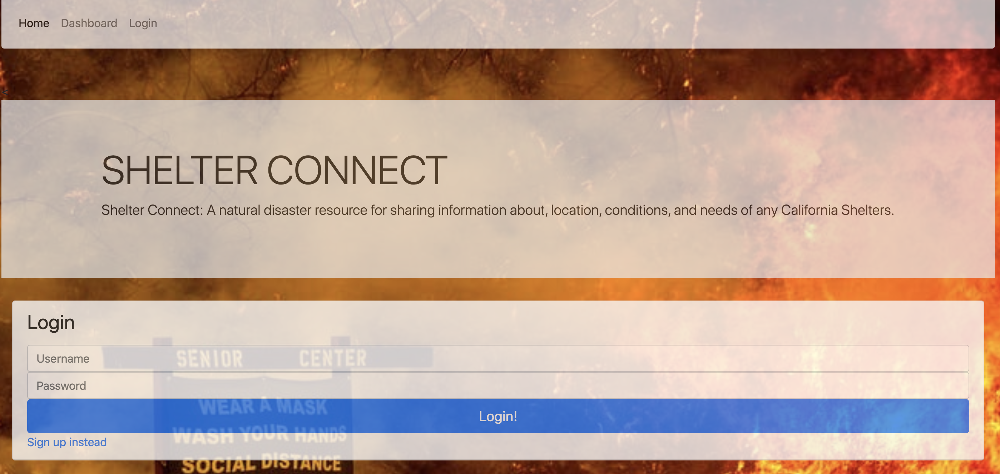
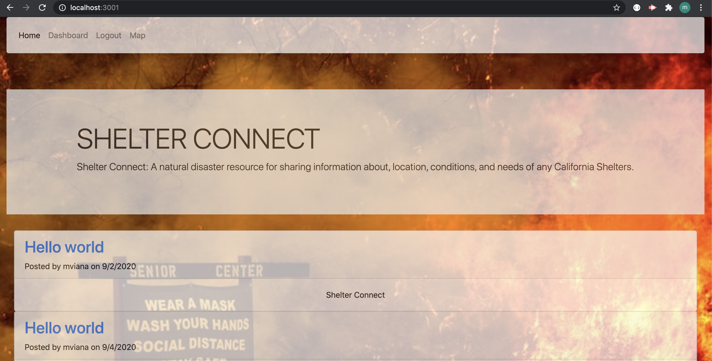
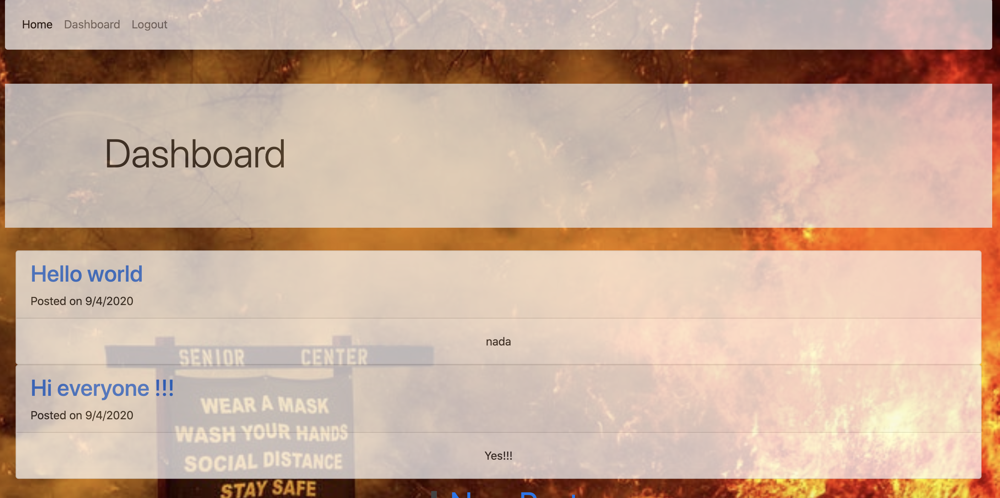

# Shelter-Connect

## Login or sign up!!!

## Home Screen Shelter-Connect!!!

## Add a New post!!!

## Dashboard!!!

# Technologies used:

* JavaScript
* Node JS
* Express JS 
* MYSQL 
* HTML 
* CSS 
* BootStrap
* Jawsdb
* Nodemon
* Dotenv
* Sequelize

# HEROKU
https://shelter-connection.herokuapp.com/

# Description:
An application that enables users to post about what shelter they’re in and helps people reconnect with friends and 
family in the event of a natural disaster. Recently we have faced unexpected natural disasters in our country everywhere, such as fires, hurricanes, storms etc. this application can help people reach out to each other and share their experiences, as well as what shelter they’re at.

